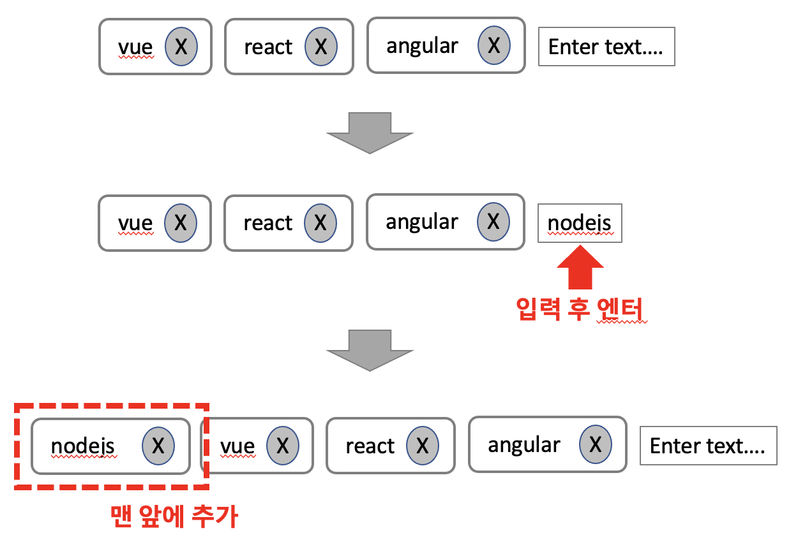
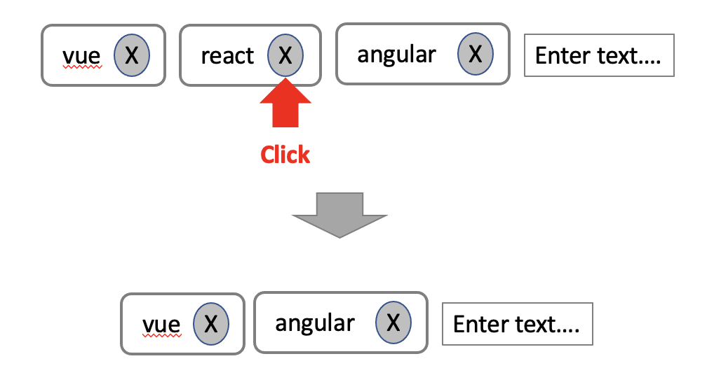
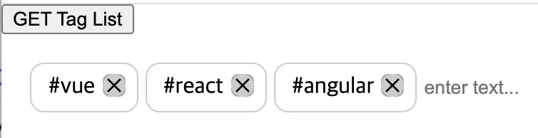

## 케이스 주제

Q. 임의 문자열을 추가 삭제할 수 있는 (SNS 태그 입력) 컴포넌트를 구현하십시오.

## 기능 요구사항

1. 텍스트 입력 후 엔터를 치면 리스트의 맨 앞에 추가가 된다.

2. 리스트 중에 아이템을 삭제 할 수 있다.

## 기능 작동 이미지

## 실행 방법 / 문제 풀이 방법
1. npm install
Run `npm install`

2. excution
Run `npm run dev`

## 문제
- q1. 데이터에 따른 문자열 리스트와 입력 폼을 함께 출력하시오.

- q2. 입력된 문자열은 키보드 이벤트 엔터를 통해 리스트의 앞단에 추가 하시오.

- q3. 입력된 문자열을 삭제할 수 있도록 하시오.

- q4. 입력된 문자열에 대한 데이터를 가져올 수 있도록 하시오.

## 주요 학습 키워드
- 동적으로 추가되는 element 
- templete 분리
- element.insertAdjacentElement 함수 활용
